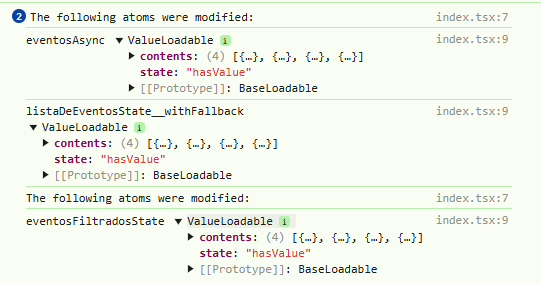

## Welcome again to another TypeScript project! 👋

# Agenda App!

## Test the project yourself: [Teste the project here!!!](https://manage-state-recoil.vercel.app/)

### Home Page


## Drag and Drop 


## Filter


## Debug observer




## Some code that I'm proud of
```js
const [data, setData] = useState('')
const [status, setStatus] = useState<IFiltroStatus>("Ambos");

const setFiltroDeEvento = useSetRecoilState<IFiltroDeEventos>(filtroDeEventos)

const submeterForm = (evento: React.FormEvent<HTMLFormElement>) => {
evento.preventDefault();
const filtro: IFiltroDeEventos = {
    status,
};
data ? (filtro.data = new Date(data)) : (filtro.data = null);

setFiltroDeEvento(filtro);
};

const opcoesFiltro = ["Ambos", "Completos", "Incompletos"];
```

## Built with

- `React`
- `React Hooks`
- `TypeScript`
- `Recoil`

## You Can
- Add, Delete and Edit Events;
- Filter events by date;
- Drag and Drop;
- Check a finished event.

## Author

- Website - [My GitHub](https://github.com/lucasbailo)
- Frontend Mentor - [@lucasbailo](https://www.frontendmentor.io/profile/lucasbailo)
- Instagram - [@lucassbailo](https://www.instagram.com/lucassbailo/)
- LinkedIn - [Lucas Bailo](https://www.linkedin.com/in/lcsbailo)